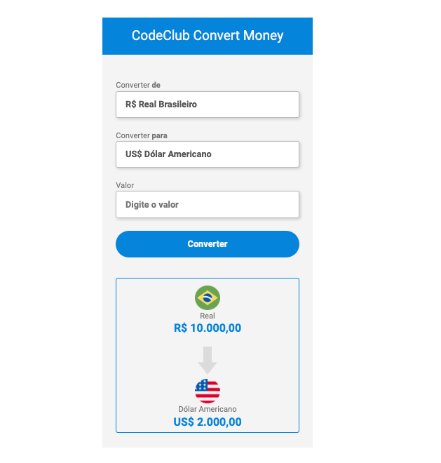

# Conversor de Moedas

> Resultado do Projeto Conversor de Moedas.

### Ajustes e melhorias

O projeto ainda está em desenvolvimento e as próximas atualizações serão voltadas nas seguintes tarefas:

- [x] Criação do HTML
- [x] Criação do CSS
- [x] Criação do Javascript
- [x] Moedas convertidas: Dólar, Euro e Bitcoin
- [ ] Conversão de novas moedas

## 🤝 Colaboradores

Agradecemos às seguintes pessoas que contribuíram para este projeto:

<table>
  <tr>
    <td align="center">
      <a href="https://www.linkedin.com/in/gustavo-gbjesus/">
         
        
          <b>Gustavo Barros</b>
        
      </a>
    </td>
  </tr>
</table>
 

[⬆ Voltar ao topo](#nome-do-projeto) 
